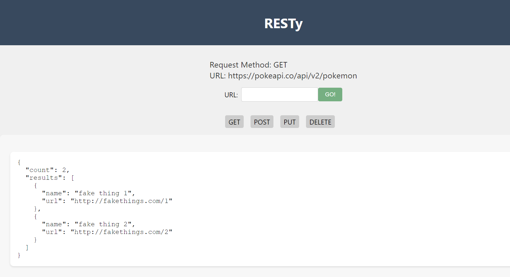
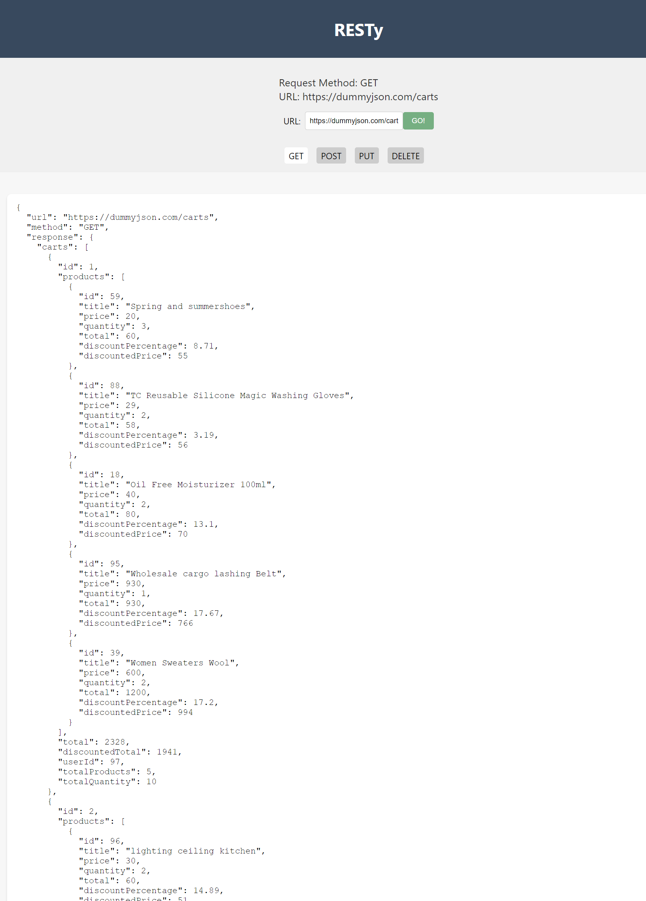

# RESTy

## Components and How They Work

1. **Header:**

   - Displays the application name "RESTy" at the top of the page.

2. **Form:**

- Allows users to input the API URL and choose an HTTP method (GET, POST, PUT, DELETE).
- When the user submits the form:
  - Sends an API request to the specified URL with the chosen HTTP method using Axios.
  - Displays the response and selected request parameters in the Results component.

3. **Results:**

   - Displays the API response in a formatted JSON format.
   - Uses the response data stored in the App component's state.

4. **Footer:**

   - Displays a simple copyright notice.

5. **App:**
   - Manages the application state and logic.
   - Renders the Header, Form, Results, and Footer components.
   - Passes down functions and data to child components.

## Getting Started

**Prerequisites:**

- Node.js and npm (Node Package Manager) should be installed on your system. You can download them from https://nodejs.org/.

**Installation:**

1. **Clone the repository:**
   ```sh
   git clone [repository_url]
   ```
2. **Navigate to the project directory**
3. **Install dependencies:**
   ```sh
   npm i
   ```
4. **Run the app**

   ```sh
   npm run
   ```

   **Interact with the App**

5. In the opened browser window, you'll see the RESTy app interface.

6. **Enter an API URL**:

   - Locate the input field labeled "URL."
   - Type or paste the desired API URL into the input field. For example: `https://api.example.com/data`.

7. **Select an HTTP Method**:

   - Just below the URL input field, you'll find buttons representing different HTTP methods: GET, POST, PUT, and DELETE.
   - Click on the appropriate button to select the desired HTTP method for the API request.

8. **Simulate Making an API Request**:

   - Once you've entered the API URL and selected an HTTP method, click the "GO!" button located next to the input field.
   - This will simulate making an API request based on your selected parameters.

9. **View the Response**:
   - After clicking "GO!", the Results section on the page will display the mock API response data in a structured JSON format.

**Example**

## lab26



## lab27


